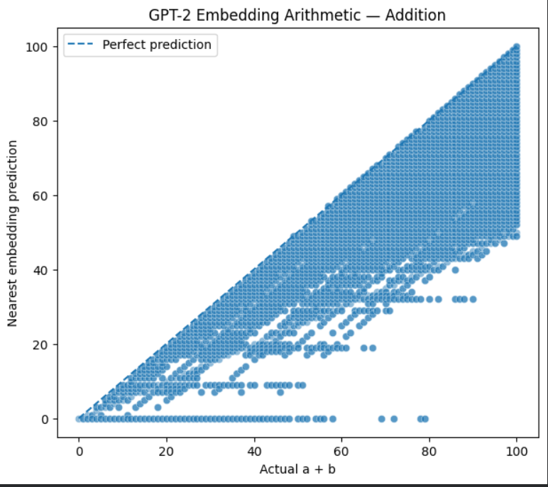
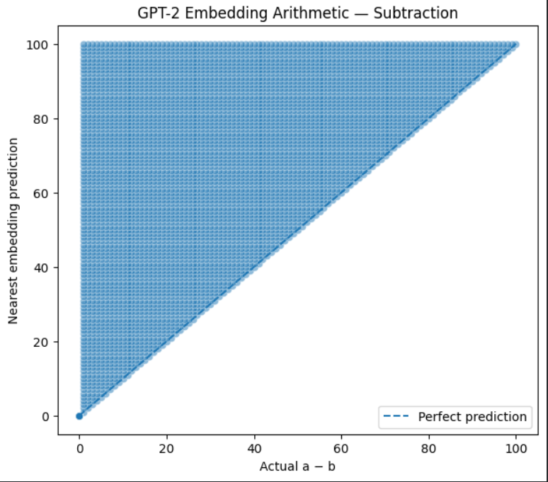
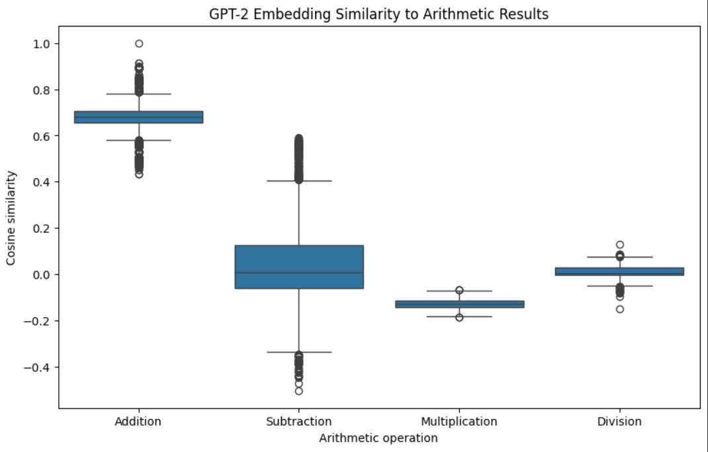

# Does GPT-2's Embedding Space Encode Arithmetic Relationships?

## Experiment Question

> **Does GPT-2's token embedding space encode arithmetic relationships such that arithmetic operations can be performed directly through vector operations?**

For example, if `E(x)` represents the GPT-2 embedding of number `x`, do we observe relationships such as:

$$
E(a) + E(b) \approx E(a+b)
$$

$$
E(a) - E(b) \approx E(a-b)
$$

$$
E(a) \odot E(b) \approx E(a\times b)
$$

$$
E(a) \oslash E(b) \approx E(a/b)
$$

where multiplication and division are element-wise vector operations?

The goal of this experiment is **not** to test whether GPT-2 can perform arithmetic when prompted with text. Instead, we investigate whether arithmetic structure is directly reflected in the geometry of its learned token embedding space.

---

## 1. Experimental Setup

### Model

* **Model:** GPT-2
* **Embedding dimension:** 768
* **Vocabulary size:** 50,257 tokens
* **Embedding used:** GPT-2's input token embedding matrix

The experiment uses:

```python
model.get_input_embeddings().weight
```

Each token is therefore represented by a 768-dimensional vector.

### Number Representation

GPT-2 uses Byte Pair Encoding (BPE) tokenization. Therefore, not every number is necessarily represented by a single token.

For this experiment, only numbers represented by a **single GPT-2 token** were used.

This avoids introducing an additional question about how multiple token embeddings should be combined to represent a number.

---

## 2. Methodology

For each valid pair of numbers $a,b$, an arithmetic operation was performed directly on their embedding vectors.

### Addition

$$
v = E(a) + E(b)
$$

The resulting vector was compared against embeddings of candidate numbers using cosine similarity.

The number with the highest cosine similarity was taken as the predicted result.

### Subtraction

$$
v = E(a) - E(b)
$$

The nearest number embedding was treated as the predicted result.

### Multiplication

$$
v = E(a) \odot E(b)
$$

where $\odot$ denotes element-wise multiplication.

### Division

$$
v = E(a) \oslash E(b)
$$

where $\oslash$ denotes element-wise division.

Division by zero was excluded, and only pairs producing integer results were considered.

---

## 3. Evaluation Metrics

Two primary metrics were used.

### 3.1 Nearest-Embedding Accuracy

For each operation, the nearest number embedding was found using cosine similarity.

The prediction was considered correct if:

$$
\hat{c}=c
$$

where $c$ is the true arithmetic result.

### 3.2 Cosine Similarity

We also measured:

$$
\cos(v,E(c))
$$

where:

* $v$ = vector produced by the arithmetic operation
* $E(c)$ = embedding of the true arithmetic result

This measures how geometrically close the constructed vector is to the embedding of the correct answer.

---

# 4. Results

The experiment produced the following results:

| Operation      | Experiments |  Accuracy | Mean Cosine Similarity | Median Cosine Similarity |
| -------------- | ----------: | --------: | ---------------------: | -----------------------: |
| Addition       |       5,151 | **1.61%** |              **0.682** |                **0.680** |
| Subtraction    |       5,151 | **3.90%** |              **0.041** |                **0.006** |
| Multiplication |         683 | **0.88%** |             **-0.129** |               **-0.130** |
| Division       |         582 | **2.06%** |              **0.008** |                **0.005** |

---

# 5. Addition

For addition, we tested:

$$
E(a)+E(b)
$$

against:

$$
E(a+b)
$$

The nearest-neighbor accuracy was:

> **1.61%**

with a mean cosine similarity of:

> **0.682**

### Visualization



The plot shows the actual arithmetic result on the x-axis and the nearest number embedding selected by the vector operation on the y-axis.

The diagonal represents perfect arithmetic prediction.

Although the cosine similarity is relatively high, the predictions are spread substantially away from the diagonal.

Therefore, **high cosine similarity alone should not be interpreted as evidence that GPT-2 is performing addition in embedding space.**

---

# 6. Subtraction

For subtraction:

$$
E(a)-E(b)
$$

was compared with:

$$
E(a-b)
$$

The observed accuracy was:

> **3.90%**

with a mean cosine similarity of only:

> **0.041**

and a median cosine similarity of:

> **0.006**

### Visualization




The prediction distribution does not closely follow the ideal diagonal relationship.

This suggests that direct vector subtraction does **not** reproduce numerical subtraction in the embedding space.

---

# 7. Multiplication

For multiplication, we tested the hypothesis:

$$
E(a)\odot E(b)
$$

where the multiplication is performed element-wise.

The results were:

* Accuracy: **0.88%**
* Mean cosine similarity: **-0.129**
* Median cosine similarity: **-0.130**

### Interpretation

The negative mean cosine similarity indicates that the resulting vectors are, on average, not aligned with the embedding of the correct numerical result.

Thus, there is little evidence that element-wise multiplication of GPT-2 token embeddings corresponds to numerical multiplication.

---

# 8. Division

For division, we tested:

$$
E(a)\oslash E(b)
$$

against:

$$
E(a/b)
$$

for pairs where $a/b$ was an integer.

Results:

* Accuracy: **2.06%**
* Mean cosine similarity: **0.008**
* Median cosine similarity: **0.005**

Again, the direct vector operation does not appear to encode the corresponding arithmetic operation.

---

# 9. Comparison of All Operations



The cosine similarity distributions show a clear difference between addition and the other operations.

Addition has substantially higher cosine similarity to the true result embeddings:

$$
\text{Addition} \approx 0.682
$$

while the other operations are close to zero or negative:

$$
\text{Subtraction} \approx 0.041
$$

$$
\text{Multiplication} \approx -0.129
$$

$$
\text{Division} \approx 0.008
$$

However, the corresponding nearest-neighbor accuracy remains low.

---

# 10. Randomized Control

To determine whether the observed addition accuracy could arise simply from the geometry of the embedding space, a randomized control was performed.

The embedding vectors themselves were kept unchanged, but their association with numerical labels was randomly shuffled.

### Addition

| Mapping                   |  Accuracy |
| ------------------------- | --------: |
| Original GPT-2 embeddings | **1.61%** |
| Randomized mapping        | **0.83%** |

The original mapping therefore achieved approximately:

$$
\frac{1.61}{0.83}\approx1.93
$$

times the accuracy of the single randomized control.

This suggests that the original embedding-number relationship may contain some structure related to numerical identity.

However, the difference is relatively small, and **one random permutation is not sufficient to establish statistical significance**.

A stronger follow-up would repeat the permutation experiment many times and construct a null distribution.

---

# 11. What Do These Results Tell Us?

The experiment provides evidence **against a simple arithmetic-vector hypothesis**.

In particular:

$$
E(a)+E(b) \not\approx E(a+b)
$$

in a way that reliably recovers the correct result.

Likewise:

$$
E(a)-E(b) \not\approx E(a-b)
$$

$$
E(a)\odot E(b) \not\approx E(ab)
$$

$$
E(a)\oslash E(b) \not\approx E(a/b)
$$

at least under the experimental setup used here.

### Important distinction

This does **not** mean that GPT-2 contains no numerical information.

It only means:

> **Arithmetic is not directly represented as a simple algebra over GPT-2's raw token embedding vectors.**

GPT-2 was trained primarily through language modeling, not with an objective requiring:

$$
E(2)+E(3)=E(5)
$$

Therefore, expecting raw vector arithmetic to perform exact numerical operations is a strong hypothesis.

---

# 12. Why Is Addition Different?

One interesting observation is that addition has a much higher cosine similarity:

$$
0.682
$$

compared with the other operations.

However, its actual nearest-neighbor accuracy is only:

$$
1.61\%
$$

This difference is important.

A high cosine similarity between the constructed vector and the true result does not necessarily imply that the vector uniquely represents that result.

The embedding space may contain common directional structure shared across many number tokens.

Therefore, the addition result should be interpreted as:

> **There appears to be stronger geometric similarity for addition than for the other tested operations, but the evidence is insufficient to claim that GPT-2's embedding space directly encodes addition.**

---

# 13. Limitations

Several limitations should be considered.

### 1. Single-token numbers

The experiment only considers numbers represented by a single GPT-2 token.

Numbers represented by multiple BPE tokens are excluded.

### 2. Raw token embeddings

We use GPT-2's input embedding matrix rather than contextual hidden representations.

The experiment therefore asks specifically about the **raw embedding space**.

### 3. Restricted numerical range

The candidate numbers are limited to a relatively small range, which also limits multiplication experiments because many products fall outside the candidate vocabulary.

### 4. Direct vector operations

The experiment assumes that arithmetic should correspond directly to simple vector operations.

A neural network could potentially encode arithmetic through a more complicated transformation.

### 5. Randomized control

Only one random permutation was used in the initial control.

A stronger experiment should use many permutations to establish a proper null distribution.

---

# 14. Conclusion

### Main Finding

> **GPT-2's raw token embedding space does not behave like a straightforward arithmetic vector space.**

Direct addition, subtraction, multiplication, and division of number embeddings do not reliably recover the embeddings of the corresponding arithmetic results.

Addition shows a noticeably stronger geometric relationship than the other operations, but the nearest-neighbor accuracy remains low:

$$
\boxed{\text{Addition accuracy}=1.61\%}
$$

compared with:

$$
\boxed{\text{Randomized control}=0.83\%}
$$

Thus, the experiment provides an interesting hint of numerical structure but **does not demonstrate that GPT-2's embeddings directly encode arithmetic relationships.**

---